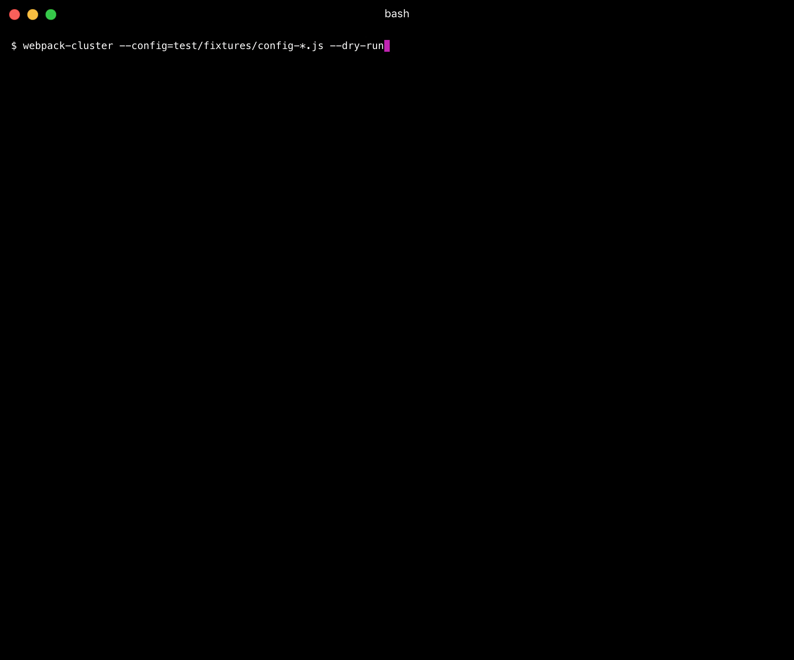

[](https://www.npmjs.org/package/webpack-cluster)
[](https://travis-ci.org/Fitbit/webpack-cluster)
[](https://ci.appveyor.com/project/mdreizin/webpack-cluster/branch/master)
[](https://codeclimate.com/github/Fitbit/webpack-cluster)
[](https://codeclimate.com/github/Fitbit/webpack-cluster)
[](https://david-dm.org/Fitbit/webpack-cluster)
[](https://david-dm.org/Fitbit/webpack-cluster#info=devDependencies)

# webpack-cluster
> Helps to make parallel webpack compilation easily



## Installation

```bash
npm install webpack-cluster --save-dev
```

or

```bash
yarn add webpack-cluster --dev
```

## Usage

CLI

```text
$ webpack-cluster --config=**/webpack.config.js [options]

Options:
  --config       Specifies configuration files using `glob` pattern
                                                              [array] [required]
  --failures     Sets failure options                            [default: true]
  --watch        Enables `watch` mode                                  [boolean]
  --dryRun       Enables `dryRun` mode                                 [boolean]
  --concurrency  Sets maximum number of concurrent compilers
                                                           [number] [default: 8]
  --silent       Suppress all output                                   [boolean]

Miscellaneous:
  --version  Outputs version number                                    [boolean]
```

Node API

<!-- eslint no-console: "allow" -->
```javascript
import WebpackCluster from 'webpack-cluster';

const webpackCluster = new WebpackCluster({
    dryRun: false,
    concurrency: 10,
    failures: {
        sysErrors: true,
        errors: true,
        warnings: true
    }
});

webpackCluster.run([
    './src/**/webpack.config.js'
]).then(results => { // In case of success
    console.log(results); // ['./src/app1/webpack.config.js', './src/app2/webpack.config.js']
}).catch(results => { // In case of any errors
    console.log(results); // [Error { filename: './src/app3/webpack.config.js', code: 2 }]
});
```

`./gulpfile.js`

```javascript
import gulp from 'gulp';
import gutil from 'gulp-util';
import WebpackCluster from 'webpack-cluster';

const webpackCluster = new WebpackCluster({
    dryRun: false,
    concurrency: 10,
    failures: {
        sysErrors: true,
        errors: true,
        warnings: true
    }
});

gulp.task('run', [], callback => {
    webpackCluster.run([
        './src/**/webpack.config.js'
    ]).then(callback).catch(err => {
        callback(new gutil.PluginError('webpack-cluster', err));
    });
});

gulp.task('watch', [], callback => {
    webpackCluster.watch([
        './src/**/webpack.config.js'
    ]).then(callback).catch(err => {
        callback(new gutil.PluginError('webpack-cluster', err));
    });
});
```
